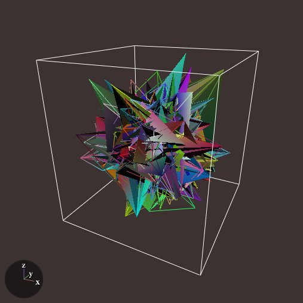

# Ply polygon file IO

**PlyIO** is a package for reading and writing data in the
[Ply](http://paulbourke.net/dataformats/ply/) polygon file format, also called
the Stanford triangle format.

[](https://travis-ci.org/FugroRoames/PlyIO.jl)
[](https://ci.appveyor.com/project/c42f/plyio-jl)

## Quick start

### Writing ply

Here's an example of how to write a basic ply file containing random triangles
and edges:

```julia
using PlyIO

ply = Ply()
push!(ply, PlyComment("An example ply file"))

nverts = 1000

# Random vertices with position and color
vertex = PlyElement("vertex",
                    ArrayProperty("x", randn(nverts)),
                    ArrayProperty("y", randn(nverts)),
                    ArrayProperty("z", randn(nverts)),
                    ArrayProperty("r", rand(nverts)),
                    ArrayProperty("g", rand(nverts)),
                    ArrayProperty("b", rand(nverts)))
push!(ply, vertex)

# Some triangular faces.
# The UInt8 is the type used for serializing the number of list elements (equal
# to 3 for a triangular mesh); the Int32 is the type used to serialize indices
# into the vertex array.
vertex_index = ListProperty("vertex_index", UInt8, Int32)
for i=1:nverts
   push!(vertex_index, rand(0:nverts-1,3))
end
push!(ply, PlyElement("face", vertex_index))

# Some edges
vertex_index = ListProperty("vertex_index", Int32, Int32)
for i=1:nverts
   push!(vertex_index, rand(0:nverts-1,2))
end
push!(ply, PlyElement("edge", vertex_index))

# For the sake of the example, ascii format is used, the default binary mode is faster.
save_ply(ply, "example1.ply", ascii=true)
```

Opening this file using a program like
[displaz](https://github.com/c42f/displaz), for example using `displaz example1.ply`,
you should see something like




### Reading ply

Reading the ply file generated above is quite simple:

```julia
julia> using PlyIO

julia> ply = load_ply("example1.ply")
PlyIO.Ply with header:
 ply
 format ascii 1.0
 comment An example ply file
 element vertex 1000
 property float64 x
 property float64 y
 property float64 z
 property float64 r
 property float64 g
 property float64 b
 element face 1000
 property list int32 int32 vertex_index
 element edge 1000
 property list int32 int32 vertex_index
 end_header

julia> ply["vertex"]
PlyElement "vertex" of length 1000 with properties ["x", "y", "z", "r", "g", "b"]

julia> ply["vertex"]["x"]
1000-element PlyIO.ArrayProperty{Float64,String} "x":
 -0.472592
  1.04326
 -0.982202
 ⋮
 -2.55605
  0.773923
 -2.10675
```

## API

### The file format

Conceptually, the ply format is a container for a set of named tables of numeric
data.  Each table, or **element**, has several named columns or **properties**.
Properties can be either simple numeric arrays (floating point or
signed/unsigned integers), or arrays of variable length lists of such numeric
values.

As described, ply is quite a generic format but it's primarily used for
geometric data. For this use there are some loose
[naming conventions](http://paulbourke.net/dataformats/ply/) which attach
geometric meaning to certian combinations of element and property names.
Unfortunately there's no official standard.

### Document object model

Ply elements are represented with the `PlyElement` type which is a list of
properties which may be looked up by name.

Properties may be represented by an `AbstractArray` type which has the the
`plyname` function defined, which should return a name for the property.  The
builtin types `ArrayProperty` and `ListProperty` are used as containers for data
when reading a ply file.

The `Ply` type is a container for several interleaved `PlyElement` and
`PlyComment` fields, in the order which would be observed in a standard ply
header.

### Reading and writing

To read and write `Ply` objects from files or `IO` streams, use the functions
`load_ply()` and `save_ply()`.
